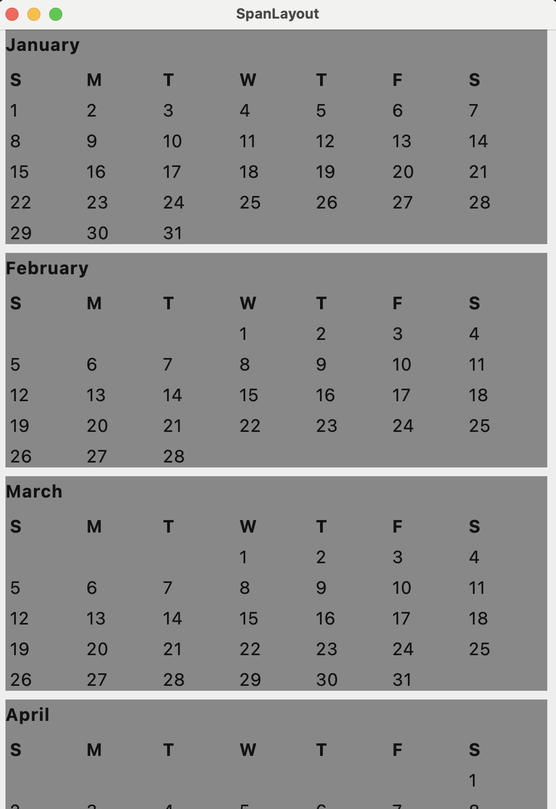
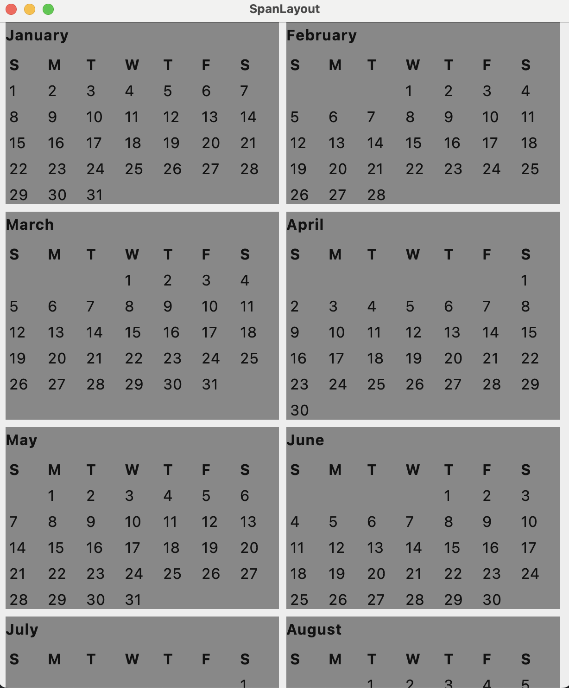
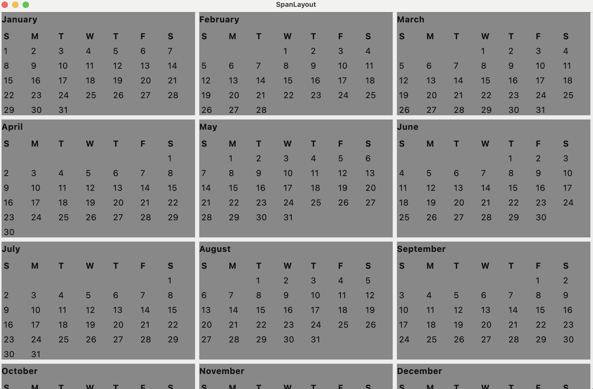

A Compose multiplatform Layout that supports that provides a "Span Layout" where the available space is divided into N columns. Each child can provide how many columns it needs to span in Compact, Medium and expanded screen widths.

This is inspired by CSS Bootstrap library's grid system and CSS media query.  

Sample usage:

```kotlin
@Composable
fun ResponsiveSpanLayout(windowWidthSizeClass: WindowWidthSizeClass) {
    Column(modifier = Modifier.verticalScroll(rememberScrollState())) {
        SpanLayout(
            windowWidthSizeClass = windowWidthSizeClass,
            modifier = Modifier.padding(horizontal = 4.dp),
            interRowSpacing = 16.dp
        ) {
            Box(
                modifier = Modifier.background(Color.Blue).height(100.dp)
                    .span(compactSpan = 12, mediumSpan = 6, expandedSpan = 4)
            )
            Box(
                modifier = Modifier.background(Color.Red).height(100.dp)
                    .span(compactSpan = 12, mediumSpan = 12, expandedSpan = 8)
            )

            Box(
                modifier = Modifier.background(Color.Red).height(100.dp)
                    .span(compactSpan = 12, mediumSpan = 12, expandedSpan = 8)
            )
            Box(
                modifier = Modifier.background(Color.Blue).height(100.dp)
                    .span(compactSpan = 12, mediumSpan = 6, expandedSpan = 4)
            )

            repeat(12) { index ->
                Box(
                    modifier = Modifier
                        .padding(horizontal = 4.dp)
                        .height(100.dp)
                        .background(Color.Red)
                        .span(
                            compactSpan = 6,
                            mediumSpan = 2,
                            expandedSpan = 1
                        ),
                    contentAlignment = Alignment.Center
                ) {
                    Text("Item $index", color = Color.White)
                }
            }
        }
    }
}

```

The above code will render differently on different window sizes based on

Compact


Medium


Expanded


More real life example (A calendar view) with nested SpanLayouts

Compact



Medium



Expanded



Code for the same. You can see that even for the Month view, SpanLayout with 7 spans is used 

```kotlin
@Composable
fun Calender(windowWidthSizeClass: WindowWidthSizeClass) {
    val daysInMonth = remember { listOf(31, 28, 31, 30, 31, 30, 31, 31, 30, 31, 30, 31) }
    val monthNames = remember { listOf("January", "February", "March", "April", "May", "June", "July", "August", "September", "October", "November", "December") }
    val dayOfTheWeekInitial = remember { listOf("S", "M", "T", "W", "T", "F", "S") }
    val daysAndMonthNames = daysInMonth.zip(monthNames)
    var skips = 0

    Column(modifier = Modifier.verticalScroll(rememberScrollState())) {
        SpanLayout(
            windowWidthSizeClass = windowWidthSizeClass,
            interRowSpacing = 8.dp,
            gutterSpace = 8.dp,
            stretchToFillRow = true
        ) {
            daysAndMonthNames.forEachIndexed { index, daysAndMonthName ->
                Column(modifier = Modifier
                    .background(Color.Gray)
                    .span(
                        compactSpan = 12,
                        mediumSpan = 6,
                        expandedSpan = 4
                    )
                ) {

                    Text(daysAndMonthName.second, fontWeight = FontWeight.Bold)

                    Spacer(modifier = Modifier.height(8.dp))

                    SpanLayout(
                        windowWidthSizeClass = windowWidthSizeClass,
                        interRowSpacing = 4.dp,
                        gutterSpace = 4.dp,
                        totalSpans = 7
                    ) {

                        dayOfTheWeekInitial.forEach {
                            Text(
                                it,
                                fontWeight = FontWeight.Bold,
                                modifier = Modifier
                                    .span(
                                        compactSpan = 1,
                                        mediumSpan = 1,
                                        expandedSpan = 1
                                    )
                            )
                        }

                        repeat(skips) {
                            Box(modifier = Modifier
                                .span(
                                    compactSpan = 1,
                                    mediumSpan = 1,
                                    expandedSpan = 1
                                ))
                        }

                        skips = (skips + daysAndMonthName.first) % 7

                        repeat(daysAndMonthName.first) { index ->
                            Text(
                                (index + 1).toString(),
                                modifier = Modifier
                                    .span(
                                    compactSpan = 1,
                                    mediumSpan = 1,
                                    expandedSpan = 1
                                )
                            )
                        }
                    }
                }
            }
        }
    }
}
```