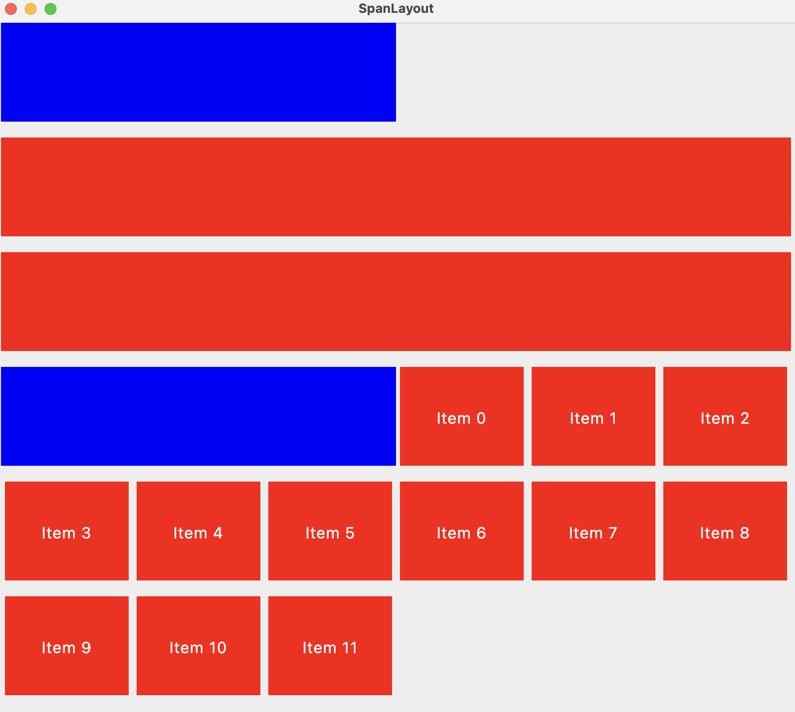

A Compose multiplatform Layout that supports that provides a "Span Layout" where the available space is divided into N columns. Each child can provide how many columns it needs to span in Compact, Medium and expanded screen widths.

Sample usage:

```kotlin
@Composable
fun ResponsiveSpanLayout(windowWidthSizeClass: WindowWidthSizeClass) {
    Column(modifier = Modifier.verticalScroll(rememberScrollState())) {
        SpanLayout(
            windowWidthSizeClass = windowWidthSizeClass,
            modifier = Modifier.padding(horizontal = 4.dp),
            interRowSpacing = 16.dp
        ) {
            Box(
                modifier = Modifier.background(Color.Blue).height(100.dp)
                    .span(compactSpan = 12, mediumSpan = 6, expandedSpan = 4)
            )
            Box(
                modifier = Modifier.background(Color.Red).height(100.dp)
                    .span(compactSpan = 12, mediumSpan = 12, expandedSpan = 8)
            )

            Box(
                modifier = Modifier.background(Color.Red).height(100.dp)
                    .span(compactSpan = 12, mediumSpan = 12, expandedSpan = 8)
            )
            Box(
                modifier = Modifier.background(Color.Blue).height(100.dp)
                    .span(compactSpan = 12, mediumSpan = 6, expandedSpan = 4)
            )

            repeat(12) { index ->
                Box(
                    modifier = Modifier
                        .padding(horizontal = 4.dp)
                        .height(100.dp)
                        .background(Color.Red)
                        .span(
                            compactSpan = 6,
                            mediumSpan = 2,
                            expandedSpan = 1
                        ),
                    contentAlignment = Alignment.Center
                ) {
                    Text("Item $index", color = Color.White)
                }
            }
        }
    }
}

```

The above code will render differently on different window sizes based on

Compact


Medium



Expanded

